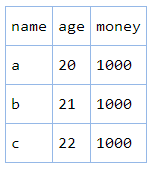

json2htmltable
===================================

convert json object to html table.

### usage:

<pre><code>$('#divTarget').html(json2htmltable.vt(testObj, 'cssClassName'));</code></pre>

***
<pre><code>$('#divTarget').html(json2htmltable.ht(testObj, 'cssClassName'));</code></pre>

 

